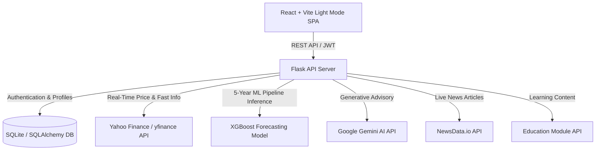

# 📈 FinGuide AI – AI-Powered Financial Advisory & Market Forecasting Platform

FinGuide AI is an intelligent personal financial advisory platform that combines machine learning (**XGBoost**), generative AI (**Google Gemini**), live news APIs (**NewsData.io**), and real-time market data (**yfinance**) to provide tailored investment recommendations, portfolio risk assessment, interactive financial education, financial Q&A, and high-accuracy stock price forecasting.

---

## 🌟 Key Features

- **☀️ Executive Light Mode UI**: Elegant slate and white design system with responsive card layouts, vibrant financial accents, and accessible typography.
- **⚡ Real-Time Stock Market Data**: Direct integration with Yahoo Finance `yfinance` (`fast_info`) for real-time live stock quotes and price changes (VOO, BND, AAPL, MSFT, NVDA, TSLA).
- **🤖 Google Gemini AI Advisor**: Dynamic financial Q&A chatbot powered by the official `google-genai` SDK (`gemini-2.5-flash`) providing real-time personalized investment advice.
- **📊 5-Year XGBoost ML Forecast Pipeline**: XGBoost Regressor model trained on 5 years of daily market data (~1,260 trading candles) with an 80% Train / 20% Out-of-Sample Test split to forecast price trajectories, trend slopes, and annualized volatility.
- **📰 Live Financial News (NewsData.io)**: Real-time financial intelligence news feed with direct links to original article sources that open in a new tab.
- **📚 Financial Education Hub**: Structured learning modules for **Beginner**, **Intermediate**, and **Advanced** investors with interactive knowledge check quizzes.
- **📈 Interactive Stock Graphs (1D, 1W, 1M, 1Y, ALL)**: Dynamic timeframe selectors on Recharts stock detail price graphs with XGBoost predictive forecast overlays.
- **🔐 Secure User Authentication & Risk Profiling**: JWT-authenticated user management with interactive risk tolerance assessment (Low, Medium, High risk scoring).

---

## 🏗 System Architecture

FinGuide AI adopts a decoupled client-server architecture with dedicated machine learning pipelines, LLM integration, and external market APIs.



### 📂 Repository Structure

```
finguide-official/
├── backend/
│   ├── routes/
│   │   ├── auth.py          # Registration & JWT Login
│   │   ├── user.py          # Profiles & Risk Assessment
│   │   ├── stocks.py        # History, Forecasts & Recommendations
│   │   ├── dashboard.py     # Real-Time Market Data, NewsData.io & AI Briefings
│   │   ├── chat.py          # Gemini AI Financial Advisor Chatbot (google-genai)
│   │   └── education.py     # Beginner, Intermediate & Advanced Modules
│   ├── ml/
│   │   └── forecaster.py    # 5-Year XGBoost forecaster & timeframe generator (1D, 1W, 1M, 1Y, ALL)
│   ├── models.py            # SQLAlchemy database models (User, UserProfile, ChatHistory)
│   ├── app.py               # Flask application factory
│   └── test_endpoints.py    # API test suite
├── frontend/
│   ├── src/
│   │   ├── components/      # Light Mode Navbar & Footer
│   │   ├── pages/
│   │   │   ├── Home.jsx
│   │   │   ├── Dashboard.jsx     # Live Tickers & NewsData.io links (opens in new tab)
│   │   │   ├── StockDetail.jsx   # Live XGBoost Price Trajectory & Recharts Graphs
│   │   │   ├── Education.jsx     # Beginner, Intermediate, Advanced Hub + Quizzes
│   │   │   ├── Recommendations.jsx
│   │   │   ├── RiskAssessment.jsx
│   │   │   ├── AIChat.jsx        # Google Gemini AI Chatbot Interface
│   │   │   ├── Profile.jsx
│   │   │   ├── Login.jsx
│   │   │   └── Register.jsx
│   │   ├── App.jsx          # React router
│   │   └── index.css        # Light Mode design system
│   ├── package.json
│   └── vite.config.js
├── .gitignore
└── README.md
```

---

## ⚙️ Technology Stack

- **Frontend**: React 18, Vite, Light Mode CSS, Recharts (Data Visualization), Lucide Icons
- **Backend**: Python 3.10+, Flask, Flask-SQLAlchemy, Flask-JWT-Extended, Flask-CORS
- **Machine Learning**: XGBoost, Scikit-Learn, Pandas, NumPy, yfinance
- **Generative AI**: Google Gemini AI API (`google-genai`)
- **News Integration**: NewsData.io REST API
- **Database**: SQLite (Development) / PostgreSQL (Production)

---

## 🚀 Environment Setup & Installation

### 1. Environment Configuration (`.env`)
Create a `.env` file inside the `backend` directory (or use environment variables):

```env
# 1. Google Gemini AI API Key (Get a free key at https://aistudio.google.com)
GEMINI_API_KEY=YOUR_GEMINI_API_KEY_HERE

# 2. NewsData.io API Key (Get a free key at https://newsdata.io)
NEWSDATA_API_KEY=YOUR_NEWSDATA_API_KEY_HERE

# 3. Security Keys
SECRET_KEY=finguide_super_secret_key_2026
JWT_SECRET_KEY=finguide_jwt_secret_key_2026

# 4. Database Connection String
DATABASE_URL=sqlite:///instance/finguide.db
```

### 2. Backend Setup
```bash
cd backend
.\venv\Scripts\activate
pip install flask flask-cors flask-sqlalchemy flask-jwt-extended xgboost scikit-learn pandas yfinance google-genai python-dotenv requests
python app.py
```
*Server runs at `http://127.0.0.1:5000/`.*

### 3. Frontend Setup
```bash
cd frontend
npm install
npm run dev
```
*Web app runs at `http://localhost:5173/`.*

---

## 🔌 API Endpoints Documentation

Base URL: `http://127.0.0.1:5000/api`

| Category | Endpoint | Method | Description | Auth Required |
| :--- | :--- | :---: | :--- | :---: |
| **Auth** | `/auth/register` | `POST` | User registration | ❌ |
| **Auth** | `/auth/login` | `POST` | User authentication & JWT issuance | ❌ |
| **User** | `/user/profile` | `GET` | Fetch investor profile & risk score | `Bearer JWT` |
| **User** | `/user/update` | `POST` | Update user risk tolerance & targets | `Bearer JWT` |
| **User** | `/user/risk-assessment` | `POST` | Calculate investor risk profile score | `Bearer JWT` |
| **Education**| `/education/modules` | `GET` | Fetch Beginner, Intermediate, Advanced courses | ❌ |
| **Stocks** | `/stocks/recommendations` | `GET` | Get asset recommendations (with `?risk=` filter) | Optional |
| **Stocks** | `/stocks/<ticker>/history` | `GET` | Fetch stock history (with `?timeframe=1D\|1W\|1M\|1Y\|ALL`) | ❌ |
| **Stocks** | `/stocks/<ticker>/predict` | `GET` | Live XGBoost price forecast & slope (with `?timeframe=`) | ❌ |
| **Dashboard**| `/dashboard/market-data` | `GET` | Real-time `yfinance` market quotes & metrics | ❌ |
| **Dashboard**| `/dashboard/news` | `GET` | Live NewsData.io financial articles with direct URLs | ❌ |
| **Dashboard**| `/dashboard/ai-briefing` | `GET` | Daily AI generated market briefing | ❌ |
| **AI Advisor**| `/chat/` | `POST` | Interactive Gemini AI financial Q&A chatbot | ❌ |

---

## 📊 Machine Learning Model Specifications (XGBoost Regressor)

- **Training Horizon**: 5 Years (~1,260 daily trading candles downloaded via `yfinance`)
- **Feature Engineering**: `Lag_1`, `Lag_2`, 20-Day SMA (`SMA_20`), 20-Day Volatility (`Volatility_20`), Volume
- **Evaluation Metric**: Mean Absolute Percentage Error (MAPE) on 1 Year of unseen test data ($\text{Accuracy} = [1 - \text{MAPE}] \times 100$)

| Ticker | Asset Name | General Trend | Model Accuracy (Unseen Test Data) | Annualized Volatility | Risk Level |
| :--- | :--- | :---: | :---: | :---: | :---: |
| **VOO** | Vanguard S&P 500 ETF | Bullish / Upward | **90.56%** | 16.97% | Low |
| **BND** | Vanguard Total Bond Market ETF | Capital Preservation | **97.97%** | 6.02% | Low |
| **MSFT**| Microsoft Corp. | Upward | **92.91%** | 26.36% | Medium |
| **AAPL**| Apple Inc. | Upward | **91.60%** | 27.43% | Medium |
| **TSLA**| Tesla Inc. | Growth Volatility | **94.79%** | 58.89% | High |
| **NVDA**| NVIDIA Corp. | Growth Volatility | **76.17%** | 51.65% | High |

---

## 📄 License

Distributed under the MIT License. See `LICENSE` for more details.