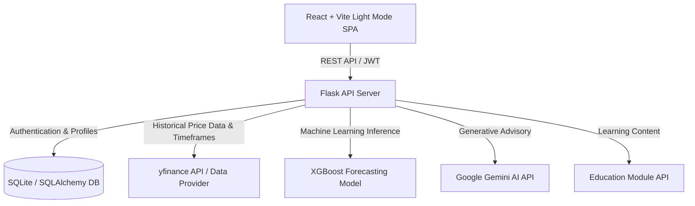

# 📈 FinGuide AI – AI-Powered Financial Advisory & Market Forecasting Platform

FinGuide AI is an intelligent personal financial advisory platform that combines machine learning (XGBoost), generative AI (Google Gemini), and real-time market data to provide tailored investment recommendations, portfolio risk assessment, interactive financial education, financial Q&A, and high-accuracy stock price forecasting.

---

## 🌟 Key Features

- **☀️ Crisp Executive Light Mode UI**: Elegant slate and white design system with responsive card layouts, vibrant financial accents, and accessible typography.
- **📚 Financial Education Hub**: Structured learning modules for **Beginner**, **Intermediate**, and **Advanced** investors with interactive knowledge check quizzes.
- **📈 Interactive Stock Graphs (1D, 1W, 1M, 1Y, ALL)**: Dynamic timeframe selectors on Recharts stock detail price graphs with XGBoost predictive forecast overlays.
- **🔐 Secure User Authentication & Risk Profiling**: JWT-authenticated user management with interactive risk tolerance assessment (Low, Medium, High risk scoring).
- **📊 XGBoost Price Forecasting & Trend Analytics**: XGBoost Regressor model trained on 5-year historical price data predicting closing prices, trend slopes, and annualized volatility metrics.
- **💡 Personalized Asset Recommendations**: Tailored stock and ETF portfolio recommendations with risk profile filter tabs (**Low**, **Medium**, **High**).
- **🤖 Gemini AI Financial Assistant**: Interactive AI chatbot providing real-time financial advice, compound growth calculations, and portfolio concepts.

---

## 🏗 System Architecture

FinGuide AI adopts a decoupled client-server architecture with dedicated machine learning pipelines and LLM integration.



### 📂 Repository Structure

```
finguide-official/
├── backend/
│   ├── routes/
│   │   ├── auth.py          # Registration & JWT Login
│   │   ├── user.py          # Profiles & Risk Assessment
│   │   ├── stocks.py        # History, Forecasts & Recommendations
│   │   ├── dashboard.py     # Market Data, News & AI Briefings
│   │   ├── chat.py          # Gemini AI Financial Advisor Chatbot
│   │   └── education.py     # Beginner, Intermediate & Advanced Modules
│   ├── ml/
│   │   └── forecaster.py    # XGBoost forecaster & timeframe generator (1D, 1W, 1M, 1Y, ALL)
│   ├── models.py            # SQLAlchemy database models (User, Profile, ChatHistory)
│   ├── app.py               # Flask application factory
│   └── test_endpoints.py    # API test suite
├── frontend/
│   ├── src/
│   │   ├── components/      # Light Mode Navbar & Footer
│   │   ├── pages/
│   │   │   ├── Home.jsx
│   │   │   ├── Dashboard.jsx
│   │   │   ├── StockDetail.jsx   # Interactive Timeframe Controls (1D, 1W, 1M, 1Y, ALL)
│   │   │   ├── Education.jsx     # Beginner, Intermediate, Advanced Hub + Quizzes
│   │   │   ├── Recommendations.jsx
│   │   │   ├── RiskAssessment.jsx
│   │   │   ├── AIChat.jsx
│   │   │   ├── Profile.jsx
│   │   │   ├── Login.jsx
│   │   │   └── Register.jsx
│   │   ├── App.jsx          # React router
│   │   └── index.css        # Light Mode design system
│   ├── package.json
│   └── vite.config.js
├── run_commands.txt
├── trend_accuracy.txt
├── .gitignore
└── README.md
```

---

## ⚙️ Technology Stack

- **Frontend**: React 18, Vite, Light Mode CSS, Recharts (Data Visualization), Lucide Icons
- **Backend**: Python 3.10+, Flask, Flask-SQLAlchemy, Flask-JWT-Extended, Flask-CORS
- **Machine Learning**: XGBoost, Scikit-Learn, Pandas, NumPy, yfinance
- **Generative AI**: Google Gemini AI API (`google-generativeai`)
- **Database**: SQLite (Development) / PostgreSQL (Production)

---

## 🚀 Setup & Installation Instructions

### 1. Backend Setup
```bash
cd backend
.\venv\Scripts\activate
pip install flask flask-cors flask-sqlalchemy flask-jwt-extended xgboost scikit-learn pandas yfinance google-generativeai python-dotenv
python app.py
```
*Server runs at `http://127.0.0.1:5000/`.*

### 2. Frontend Setup
```bash
cd frontend
npm install
npm run dev
```
*Web app runs at `http://localhost:5173/`.*

---

## 🔌 API Endpoints Documentation

Base URL: `http://127.0.0.1:5000/api`

| Category | Endpoint | Method | Description | Auth Required |
| :--- | :--- | :---: | :--- | :---: |
| **Auth** | `/auth/register` | `POST` | User registration | ❌ |
| **Auth** | `/auth/login` | `POST` | User authentication & JWT issuance | ❌ |
| **User** | `/user/profile` | `GET` | Fetch investor profile & risk score | `Bearer JWT` |
| **User** | `/user/update` | `POST` | Update user risk tolerance & targets | `Bearer JWT` |
| **User** | `/user/risk-assessment` | `POST` | Calculate investor risk profile score | `Bearer JWT` |
| **Education**| `/education/modules` | `GET` | Fetch Beginner, Intermediate, Advanced courses | ❌ |
| **Stocks** | `/stocks/recommendations` | `GET` | Get asset recommendations (with `?risk=` filter) | Optional |
| **Stocks** | `/stocks/<ticker>/history` | `GET` | Fetch stock history (with `?timeframe=1D\|1W\|1M\|1Y\|ALL`) | ❌ |
| **Stocks** | `/stocks/<ticker>/predict` | `GET` | XGBoost price forecast & slope (with `?timeframe=`) | ❌ |
| **Dashboard**| `/dashboard/market-data` | `GET` | Real-time market overview & stock metrics | ❌ |
| **Dashboard**| `/dashboard/news` | `GET` | Financial news & market updates | ❌ |
| **Dashboard**| `/dashboard/ai-briefing` | `GET` | Daily AI generated market briefing | ❌ |
| **AI Advisor**| `/chat/` | `POST` | Interactive Gemini AI financial Q&A chatbot | ❌ |

---

## 📊 Machine Learning Model Accuracy (XGBoost Regressor)

| Ticker | Asset Name | General Trend | Model Accuracy (Unseen Data) | Annualized Volatility | Risk Level |
| :--- | :--- | :---: | :---: | :---: | :---: |
| **BND** | Vanguard Total Bond Market ETF | Downward | **97.97%** | 6.02% | Low |
| **TSLA**| Tesla Inc. | Downward | **94.79%** | 58.89% | High |
| **MSFT**| Microsoft Corp. | Upward | **92.91%** | 26.36% | Medium |
| **AAPL**| Apple Inc. | Downward | **91.60%** | 27.43% | Medium |
| **VOO** | Vanguard S&P 500 ETF | Downward | **88.89%** | 16.81% | Low |
| **NVDA**| NVIDIA Corp. | Downward | **76.17%** | 51.65% | High |

---

## 📄 License

Distributed under the MIT License. See `LICENSE` for more details.