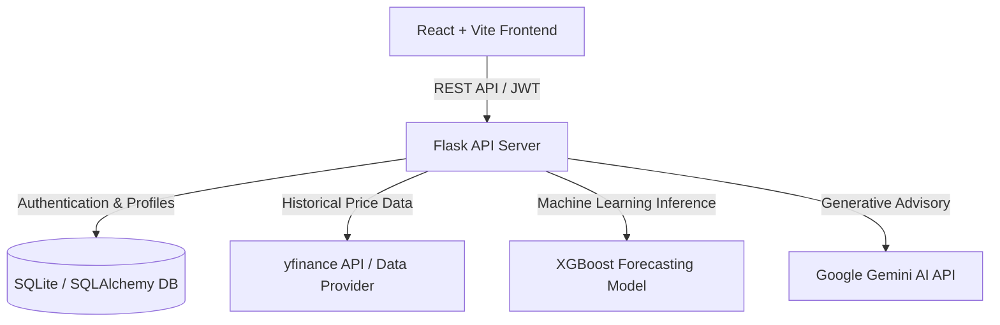

# 📈 FinGuide AI – AI-Powered Financial Advisory & Market Forecasting Platform

FinGuide AI is an intelligent personal financial advisory platform that combines machine learning (XGBoost), generative AI (Google Gemini), and real-time market data to provide tailored investment recommendations, portfolio risk assessment, financial Q&A, and high-accuracy stock price forecasting.

---

## 🌟 Key Features

- **🔐 Secure User Authentication & Risk Profiling**: JWT-authenticated user management with interactive risk tolerance assessment (Low, Medium, High risk scoring) to tailor investment strategies.
- **📊 XGBoost Price Forecasting & Trend Analytics**: Uses an XGBoost Regressor model trained on 5-year historical price data to predict future closing prices, trend slopes, and annualized volatility metrics.
- **💡 Personalized Stock & ETF Recommendations**: Recommends curated assets (e.g., S&P 500 ETFs, Total Bond Market, Tech Leaders) based on individual user risk profiles and financial targets.
- **🤖 Gemini AI Financial Assistant**: Interactive AI chatbot providing real-time financial advice, portfolio guidance, compound interest calculations, and investment concepts.
- **📰 Market Intelligence & Daily AI Briefings**: Automated daily market updates, news feeds, and macro financial briefings generated via AI.
- **📈 Real-Time Data & Historical Charts**: Interactive visualization of price trends, key metrics, and historical stock performance.

---

## 🏗 System Architecture

FinGuide AI adopts a decoupled client-server architecture with dedicated machine learning pipelines and LLM integration.



### 📂 Repository Structure

```
finguide-official/
├── backend/
│   ├── routes/              # Flask API blueprints (auth, user, stocks, dashboard, chat)
│   ├── ml/                  # XGBoost model training scripts & feature engineering
│   ├── models.py            # SQLAlchemy database models (User, Profile, Portfolio)
│   ├── app.py               # Flask application factory & entry point
│   ├── test_endpoints.py    # API test suite for backend routes
│   └── .env                 # Environment variables configuration
├── frontend/
│   ├── src/
│   │   ├── components/      # Reusable UI components (Charts, Cards, Navigation)
│   │   ├── pages/           # Application views (Dashboard, Portfolio, AI Chat, Profile)
│   │   ├── App.jsx          # React main application entry & routing
│   │   └── index.css        # Global CSS & design system
│   ├── package.json         # Dependencies & scripts
│   └── vite.config.js       # Vite bundler setup
├── run_commands.txt         # Quick start reference guide
├── trend_accuracy.txt       # XGBoost model evaluation benchmarks
├── .gitignore               # Ignored build & environment files
└── README.md                # Project documentation
```

---

## ⚙️ Technology Stack

- **Frontend**: React, Vite, CSS, Recharts (Data Visualization), Lucide Icons
- **Backend**: Python 3.10+, Flask, Flask-SQLAlchemy, Flask-JWT-Extended, Flask-CORS
- **Machine Learning**: XGBoost, Scikit-Learn, Pandas, NumPy, yfinance
- **Generative AI**: Google Gemini AI API (`google-generativeai`)
- **Database**: SQLite (Development) / PostgreSQL (Production)

---

## 🚀 Setup & Installation Instructions

### Prerequisites
- Python `3.10` or higher
- Node.js `v18.0` or higher & `npm`

---

### 1. Backend Setup

1. **Navigate to the backend directory**:
   ```bash
   cd backend
   ```

2. **Create and activate a virtual environment**:
   - **Windows**:
     ```powershell
     python -m venv venv
     .\venv\Scripts\activate
     ```
   - **macOS / Linux**:
     ```bash
     python3 -m venv venv
     source venv/bin/activate
     ```

3. **Install backend dependencies**:
   ```bash
   pip install flask flask-cors flask-sqlalchemy flask-jwt-extended xgboost scikit-learn pandas yfinance google-generativeai python-dotenv
   ```

4. **Configure Environment Variables**:
   Create a `.env` file inside the `backend` folder:
   ```env
   FLASK_APP=app.py
   FLASK_ENV=development
   SECRET_KEY=your_super_secret_key
   JWT_SECRET_KEY=your_jwt_secret_key
   DATABASE_URL=sqlite:///instance/finguide.db
   GEMINI_API_KEY=your_google_gemini_api_key
   ```

5. **Run the Flask Backend Server**:
   ```bash
   python app.py
   ```
   *The server will start at `http://127.0.0.1:5000/`.*

---

### 2. Frontend Setup

1. **Navigate to the frontend directory**:
   ```bash
   cd frontend
   ```

2. **Install Node dependencies**:
   ```bash
   npm install
   ```

3. **Start the Vite Development Server**:
   ```bash
   npm run dev
   ```
   *The frontend application will run at `http://localhost:5173/`.*

---

## 🔌 API Endpoints Documentation

Base URL: `http://127.0.0.1:5000/api`

| Category | Endpoint | Method | Description | Auth Required |
| :--- | :--- | :---: | :--- | :---: |
| **Auth** | `/auth/register` | `POST` | User registration | ❌ |
| **Auth** | `/auth/login` | `POST` | User authentication & JWT issuance | ❌ |
| **User** | `/user/profile` | `GET` | Fetch investor profile & risk score | `Bearer JWT` |
| **User** | `/user/update` | `POST` | Update user risk tolerance & targets | `Bearer JWT` |
| **User** | `/user/risk-assessment` | `POST` | Calculate investor risk profile score | `Bearer JWT` |
| **Stocks** | `/stocks/recommendations` | `GET` | Get personalized asset recommendations | `Bearer JWT` |
| **Stocks** | `/stocks/<ticker>/history` | `GET` | Fetch 5-year historical price data | ❌ |
| **Stocks** | `/stocks/<ticker>/predict` | `GET` | Get XGBoost price forecast & trend slope | ❌ |
| **Dashboard**| `/dashboard/market-data` | `GET` | Real-time market overview & stock metrics | ❌ |
| **Dashboard**| `/dashboard/news` | `GET` | Financial news & market updates | ❌ |
| **Dashboard**| `/dashboard/ai-briefing` | `GET` | Daily AI generated market briefing | ❌ |
| **AI Advisor**| `/chat/` | `POST` | Interactive Gemini AI financial Q&A chatbot | ❌ |

---

## 📊 Machine Learning Model Accuracy (XGBoost Regressor)

The XGBoost Regressor model is trained on 80% (4 years) of historical daily market data to predict out-of-sample closing prices (evaluated on the remaining 20% unseen test data using Mean Absolute Percentage Error, `Accuracy = (1 - MAPE) * 100`):

| Ticker | Asset Name | General Trend | Model Accuracy (Unseen Data) | Annualized Volatility | Risk Level |
| :--- | :--- | :---: | :---: | :---: | :---: |
| **BND** | Vanguard Total Bond Market ETF | Downward | **97.97%** | 6.02% | Low |
| **TSLA**| Tesla Inc. | Downward | **94.79%** | 58.89% | High |
| **MSFT**| Microsoft Corp. | Upward | **92.91%** | 26.36% | Medium |
| **AAPL**| Apple Inc. | Downward | **91.60%** | 27.43% | Medium |
| **VOO** | Vanguard S&P 500 ETF | Downward | **88.89%** | 16.81% | Low |
| **NVDA**| NVIDIA Corp. | Downward | **76.17%** | 51.65% | High |

---

## 📄 License

Distributed under the MIT License. See `LICENSE` for more details.